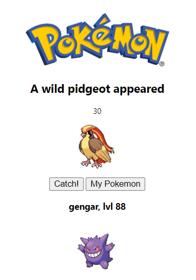

# Pokemon Catcher

This is a browser extension where you can grab the pokemons! When you change your tab a wild pokemon will appear and you can catch with your pokeball! This Chrome extension was build with HTML, CSS and JS

## How to run

First you need to clone this repository.

Open Google chrome and access `chrome://extensions/`

Turn on the developer mode and choose the load unpacked option.

Open the POKEMONEXTENSION folder and catch all Pokemons!

## 🔍 Project Breakdown
Your extension does the following:

  🧠 Picks a random Pokémon using the PokéAPI when a tab is updated.
  
  📬 Sends the Pokémon data to the popup via a Chrome message listener.
  
  🖼️ Displays the Pokémon in a popup.html with image, name, level, and "Catch!" button.
  
  📦 Saves caught Pokémon to localStorage and shows them on demand.
