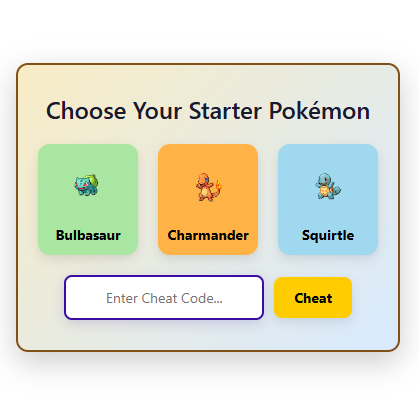

# Pokemon Catcher

## Intro

🧠 We're a group of smart, creative, and intellectually curious software developers.
We don’t just code — we design, integrate, and implement elegant solutions that make people go “wow.”

🎯 What this project is NOT:

Not for monetization 💰

No deadlines ⏳

No pressure 🚫

Just passion, learning, and expression 🚀

Let’s create something amazing together. If you’ve got ideas, questions, or just wanna geek out over Pokémon and code — this is the place!

## How to run

First you need to clone this repository.

Open Google chrome and access `chrome://extensions/`

Turn on the developer mode and choose the load unpacked option.

Open the POKEMONEXTENSION folder and catch all Pokemons!

## 🔍 Project Breakdown
Your extension does the following:

  🧠 Picks a random Pokémon using the PokéAPI when a tab is updated.
  
  📬 Sends the Pokémon data to the popup via a Chrome message listener.
  
  🖼️ Displays the Pokémon in a popup.html with image, name, level, and "Catch!" button.
  
  📦 Saves caught Pokémon to localStorage and shows them on demand.
